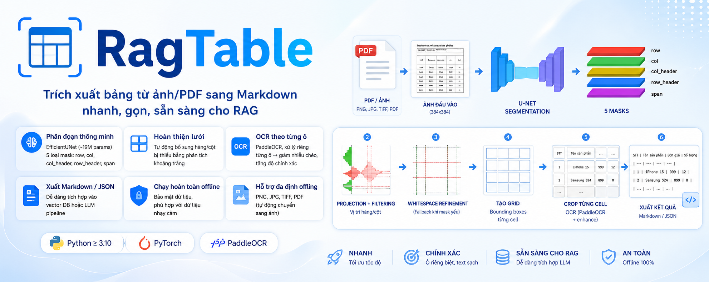

<p align="center">
  
</p>

<h1 align="center">RagTable</h1>
<p align="center">
  <b>Trích xuất bảng từ ảnh/PDF sang Markdown – nhanh, gọn, sẵn sàng cho RAG</b>
</p>

<p align="center">
  <a href="https://pypi.org/project/ragtab/"></a>
  <a href="https://pypi.org/project/ragtab/"></a>
  <a href="LICENSE"></a>
</p>

---

## 🚀 Tính năng

* **Phân đoạn cấu trúc bảng** bằng EfficientUNet (~19M params) với 5 loại mask:
  `row`, `col`, `col_header`, `row_header`, `span`
* **Hoàn thiện lưới thông minh**: tự động bổ sung hàng/cột bị thiếu bằng phân tích khoảng trắng
* **OCR theo từng ô** (PaddleOCR) → giảm nhiễu chéo, tăng độ chính xác
* **Xuất Markdown / JSON** → dễ dàng tích hợp vào vector DB hoặc LLM pipeline
* **Chạy hoàn toàn offline** → phù hợp với dữ liệu nhạy cảm
* **Hỗ trợ nhiều định dạng**: PNG, JPG, TIFF, PDF (tự động chuyển sang ảnh)

---

## 📦 Cài đặt

```bash
pip install ragtab
```

**Yêu cầu:**

* Python ≥ 3.10
* PyTorch (cài riêng nếu chưa có)

OCR sử dụng **PaddleOCR** và sẽ được cài tự động.

### Cài từ source (tuỳ chọn)

```bash
git clone https://github.com/<your-username>/ragtab.git
cd ragtab
pip install -e .
```

---

## ⚡ Quickstart

```python
from ragtab.pipeline import extract_table

markdown, cells = extract_table(
    "bang_mau.png",
    model_path="checkpoints/unet_best.pt",
    ocr_engine="paddleocr"  # hoặc "tesseract"
)

print(markdown)
```

**Kết quả:**

```
| STT | Tên sản phẩm | Đơn giá | Số lượng |
| --- | ----------- | ------- | -------- |
| 1   | iPhone 15   | 999     | 12       |
| 2   | Samsung S24 | 899     | 8        |
```

### Chế độ nhẹ (không cần model)

```python
from ragtab.heuristic import whitespace_table_extraction

markdown = whitespace_table_extraction("bang_thuong.png")
```

→ Nhanh, nhẹ, phù hợp khi không có checkpoint.

---

## 🧠 Pipeline hoạt động

```
Ảnh đầu vào (384x384)
       │
       ▼
[1] U-Net Segmentation → row + col (+ header/span)
       │
       ▼
[2] Projection + filtering → vị trí hàng/cột
       │
       ▼
[3] Whitespace refinement (fallback khi mask yếu)
       │
       ▼
[4] Tạo grid → bounding boxes từng cell
       │
       ▼
[5] Crop từng cell → OCR (PaddleOCR + enhance)
       │
       ▼
[6] Xuất Markdown / JSON
```

Tất cả các bước đều có thể dùng độc lập để tuỳ chỉnh pipeline.

---

## 🗂️ Cấu trúc dự án

```
ragtab/
├── __init__.py
├── detection.py      # xử lý row/col từ mask
├── ocr.py            # crop, OCR, xử lý text
├── pipeline.py       # extract_table() / TableExtractor
├── heuristic.py      # phương pháp fallback
└── utils.py          # resize, padding, helpers
```

---

## 🔧 Model

RagTable sử dụng U-Net checkpoint (`.pt`):

Bạn có thể:

* Train lại bằng notebook: `notebooks/02_table-recognition.ipynb`
* Hoặc tải checkpoint có sẵn (Google Drive / Hugging Face)

Sau đó đặt vào thư mục:

```
checkpoints/
```

và truyền vào:

```python
model_path="checkpoints/unet_best.pt"
```

---

## 📝 License

MIT – tự do sử dụng, kể cả cho mục đích thương mại.

---

## 👤 Tác giả

**Dinh Duc Tai**
📧 [dinhductai2004@gmail.com](mailto:dinhductai2004@gmail.com)

---